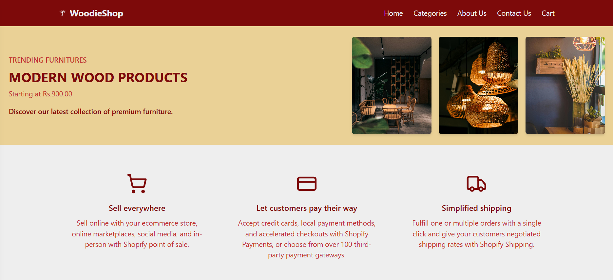
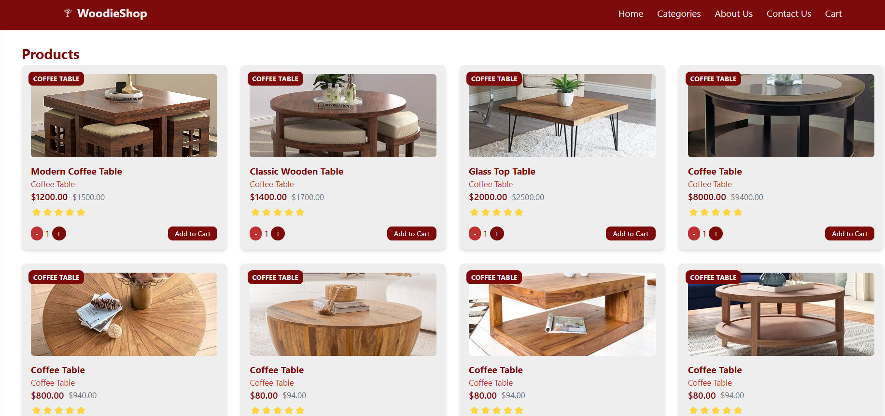

# 🪵 WoodieShop

**WoodieShop** is an elegant and responsive e-commerce website for wooden products. Built using **React** and **Tailwind CSS**, it features a modern UI, product showcase, and simple cart functionality. This project highlights a clean frontend design tailored for showcasing handcrafted or wooden items.

---

## 🛍️ Features

- 🖼️ View a list of wooden products
- 📃 Product details with images and descriptions
- 🛒 Add-to-cart button (UI level)
- 📩 Contact Us and About Us sections
- 🎨 Responsive design using Tailwind CSS
- ⚛️ React-based component structure

---

## 🛠️ Tech Stack

- **Frontend**: React
- **Styling**: Tailwind CSS
- **Build Tool**: Vite
- **Language**: JavaScript (ES6)

---

### 🏠 Home Page


### 🛍️ Product Section


## 📦 Installation

To run the project locally:

```bash
# Clone the repository
git clone https://github.com/suvetharani/WoodieShop.git

# Go into the project directory
cd WoodieShop

# Install dependencies
npm install

# Start the development server
npm run dev
```

🙋‍♀️ Author
Developed by Suvetharani
